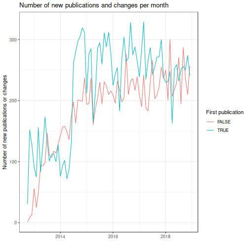
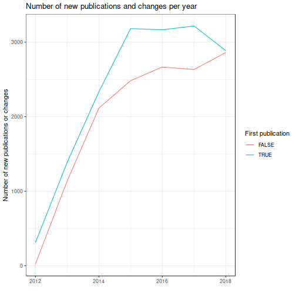
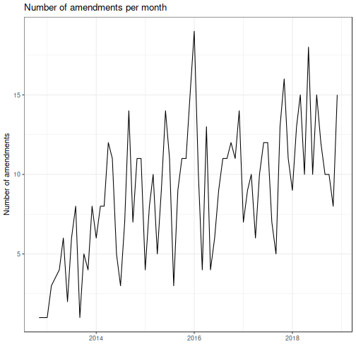
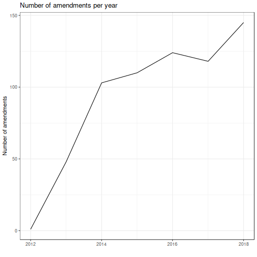
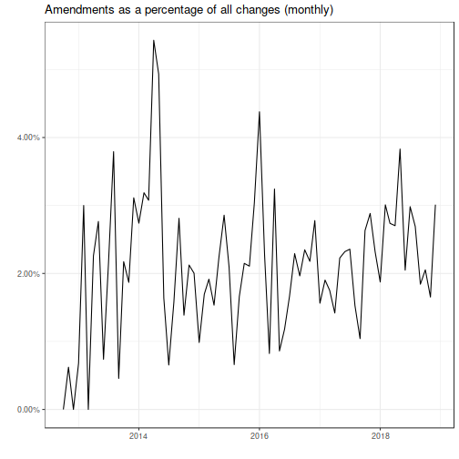
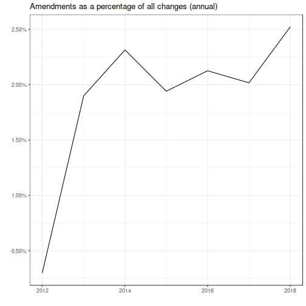
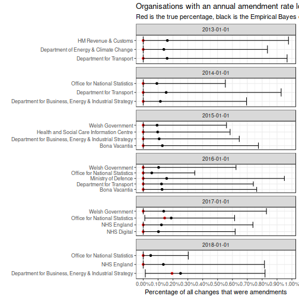
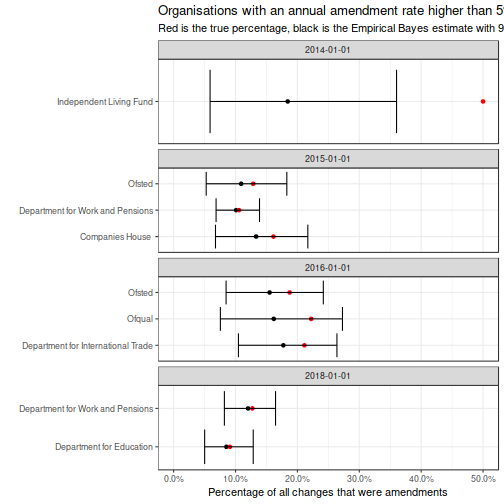

# Explore amendments in GOV.UK statistics publications


```r
library(tidyverse)
library(lubridate)
library(ebbr)
library(here)

reports <- readRDS(here("reports.Rds"))
```

```
## Error in here("reports.Rds"): unused argument ("reports.Rds")
```

## Extract the change history of each report


```r
reports <- readRDS(here("reports.Rds"))
```

```
## Error in here("reports.Rds"): unused argument ("reports.Rds")
```

```r
empty_changes <- tibble(public_timestamp = character(),
                        note = character())

chuck_changes <-
  function(.x) {
    out <- purrr::chuck(.x, "details", "change_history") # purrr::chuck() not on CRAN
    if (is.null(out)) {
      stop("null!") # change_history can be present yet NULL
    }
    out
  }
possibly_pluck_changes <- possibly(chuck_changes, otherwise = empty_changes)

chuck_organisation <-
  function(.x) {
    out <- purrr::chuck(.x, # purrr::chuck() not on CRAN
                        "links",
                        "primary_publishing_organisation",
                        "title")
    if (is.null(out)) {
      stop("null!") # element can be present yet NULL
    }
    out
  }
possibly_pluck_organisation <-
  possibly(chuck_organisation, otherwise = NA_character_)

changes <-
  reports %>%
  mutate(organisation = map_chr(reports, possibly_pluck_organisation),
         changes = map(reports, possibly_pluck_changes)) %>%
  select(-reports) %>%
  unnest() %>%
  mutate(public_timestamp = parse_datetime(public_timestamp),
         month = floor_date(public_timestamp, "month"),
         year = floor_date(public_timestamp, "year"),
         is_first_publication = note == "First published.",
         is_amendment = str_detect(note,
                                   regex("(mistake)|(error)|(correct)|(wrong)|(amend)",
                                         ignore_case = TRUE)),
         is_amendment = is_amendment & !str_detect(note, "Updated to reflect amendments made to existing licences since previous publication"))

no_changes <- anti_join(reports, changes, by = "base_path")
```

## How many changes?


```r
# Many first publications were backdated.  The date of the first change is a
# reasonable estimate for the date that GOV.UK first published statistics
first_change_date <-
  changes %>%
  dplyr::filter(!is_first_publication) %>%
  pull(public_timestamp) %>%
  min()
```

### Changes per month


```r
changes %>%
  dplyr::filter(public_timestamp >= first_change_date,
                month < max(month)) %>% # drop the latest (incomplete) month
  count(month, is_first_publication) %>%
  ggplot(aes(month, n, colour = is_first_publication)) +
  geom_line() +
  scale_colour_discrete(name = "First publication") +
  xlab("") +
  ylab("Number of new publications or changes") +
  ggtitle("Number of new publications and changes per month") +
  theme_bw()
```



### Changes per year


```r
changes %>%
  dplyr::filter(public_timestamp >= first_change_date,
                year < max(year)) %>% # drop the latest (incomplete) year
  count(year, is_first_publication) %>%
  ggplot(aes(year, n, colour = is_first_publication)) +
  geom_line() +
  scale_colour_discrete(name = "First publication") +
  xlab("") +
  ylab("Number of new publications or changes") +
  ggtitle("Number of new publications and changes per year") +
  theme_bw()
```



## How many amendments?


```r
amendments <- dplyr::filter(changes, is_amendment)
```

### Amendments per month


```r
amendments %>%
  dplyr::filter(public_timestamp >= first_change_date,
                month < max(month)) %>% # drop the latest (incomplete) month
  count(month) %>%
  ggplot(aes(month, n)) +
  geom_line() +
  xlab("") +
  ylab("Number of amendments") +
  ggtitle("Number of amendments per month") +
  theme_bw()
```



### Amendments per year


```r
amendments %>%
  dplyr::filter(public_timestamp >= first_change_date,
                year < max(year)) %>% # drop the latest (incomplete) year
  count(year) %>%
  ggplot(aes(year, n)) +
  geom_line() +
  xlab("") +
  ylab("Number of amendments") +
  ggtitle("Number of amendments per year") +
  theme_bw()
```



### Amendments as percentage of all changes per month


```r
changes %>%
  dplyr::filter(public_timestamp >= first_change_date,
                month < max(month)) %>% # drop the latest (incomplete) month
  count(month, is_amendment) %>%
  spread(is_amendment, n, fill = 0L) %>%
  mutate(amendment_prop = `TRUE` / (`TRUE` + `FALSE`)) %>%
  ggplot(aes(month, amendment_prop)) +
  geom_line() +
  scale_y_continuous(labels = scales::percent) +
  xlab("") +
  ylab("") +
  ggtitle("Amendments as a percentage of all changes (monthly)") +
  theme_bw()
```



### Amendments as percentage of all changes per year


```r
changes %>%
  dplyr::filter(public_timestamp >= first_change_date,
                year < max(year)) %>% # drop the latest (incomplete) year
  count(year, is_amendment) %>%
  spread(is_amendment, n, fill = 0L) %>%
  mutate(amendment_prop = `TRUE` / (`TRUE` + `FALSE`)) %>%
  ggplot(aes(year, amendment_prop)) +
  geom_line() +
  scale_y_continuous(labels = scales::percent) +
  xlab("") +
  ylab("") +
  ggtitle("Amendments as a percentage of all changes (annual)") +
  theme_bw()
```



### Organisations with the highest and lowest rate of amendments
Using fitted Empirical Bayes model to reduce noise of orgs with few
publications.


```r
changes %>%
  dplyr::filter(public_timestamp >= first_change_date,
                year < max(year)) %>% # drop the latest (incomplete) year
  count(year, organisation, is_amendment) %>%
  spread(is_amendment, n, fill = 0L) %>%
  mutate(total = `TRUE` + `FALSE`,
         amendments = `TRUE`) %>%
  select(-`TRUE`, -`FALSE`) %>%
  add_ebb_estimate(amendments, total) %>%
  # keep orgs with less than this rate of amendments
  dplyr::filter(.high <= .01) %>%
  ggplot(aes(organisation)) +
  geom_point(aes(y = .fitted)) +
  geom_point(aes(y = amendments / total), colour = "red") +
  geom_errorbar(aes(ymin = .low, ymax = .high)) +
  scale_y_continuous(labels = scales::percent,
                     limits = c(0, NA),
                     breaks = seq(0, 1, by = .001)) +
  ggtitle("Organisations with an annual amendment rate lower than 1%",
          subtitle = "Red is the true percentage, black is the Empirical Bayes estimate with 95% credible interval") +
  facet_wrap(~ year, ncol = 1, scales = "free_y") +
  coord_flip() +
  xlab("") +
  ylab("Percentage of all changes that were amendments") +
  theme_bw()
```



```r
ggsave("org-amendment-rate-lowest.png")
```

```
## Saving 7 x 7 in image
```

```r
changes %>%
  dplyr::filter(public_timestamp >= first_change_date,
                year < max(year)) %>% # drop the latest (incomplete) year
  count(year, organisation, is_amendment) %>%
  spread(is_amendment, n, fill = 0L) %>%
  mutate(total = `TRUE` + `FALSE`,
         amendments = `TRUE`) %>%
  select(-`TRUE`, -`FALSE`) %>%
  add_ebb_estimate(amendments, total) %>%
  # keep orgs with at least this rate of amendments
  dplyr::filter(.low >= .05) %>%
  ggplot(aes(organisation)) +
  geom_point(aes(y = .fitted)) +
  geom_point(aes(y = amendments / total), colour = "red") +
  geom_errorbar(aes(ymin = .low, ymax = .high)) +
  scale_y_continuous(labels = scales::percent,
                     limits = c(0, NA),
                     breaks = seq(0, 1, by = .1)) +
  ggtitle("Organisations with an annual amendment rate higher than 5%",
          subtitle = "Red is the true percentage, black is the Empirical Bayes estimate with 95% credible interval") +
  facet_wrap(~ year, ncol = 1, scales = "free_y") +
  coord_flip() +
  xlab("") +
  ylab("Percentage of all changes that were amendments") +
  theme_bw()
```



```r
ggsave("org-amendment-rate-highest.png")
```

```
## Saving 7 x 7 in image
```

### Code to inspect apparent amendment notes of particular organisations


```r
changes %>%
  dplyr::filter(is_amendment,
                organisation == "Department for Education") %>%
  count(note, sort = TRUE)
```

```
## # A tibble: 53 x 2
##    note                                                                   n
##    <chr>                                                              <int>
##  1 " Updated parliamentary constituency underlying data table to cor…     1
##  2 A correction has been made to the Inner and Outer London staffing…     1
##  3 "A minor amendment has been made to A level pass rate within Main…     1
##  4 Added 'Additional methodologies at school and LA levels' document…     1
##  5 Added additional underlying data to include LA district level inf…     1
##  6 Added results for Bedford local authority. Changed the distributi…     1
##  7 Additional tables 2 - updated 01/05/2014. Figures for Reading loc…     1
##  8 Amended EBacc English explanation in section 6 of the main text d…     1
##  9 Amended KS1 metadata file in 'Underlying data'.                        1
## 10 Amended percentages for inner London in tables 8a and 8c in the l…     1
## # … with 43 more rows
```

